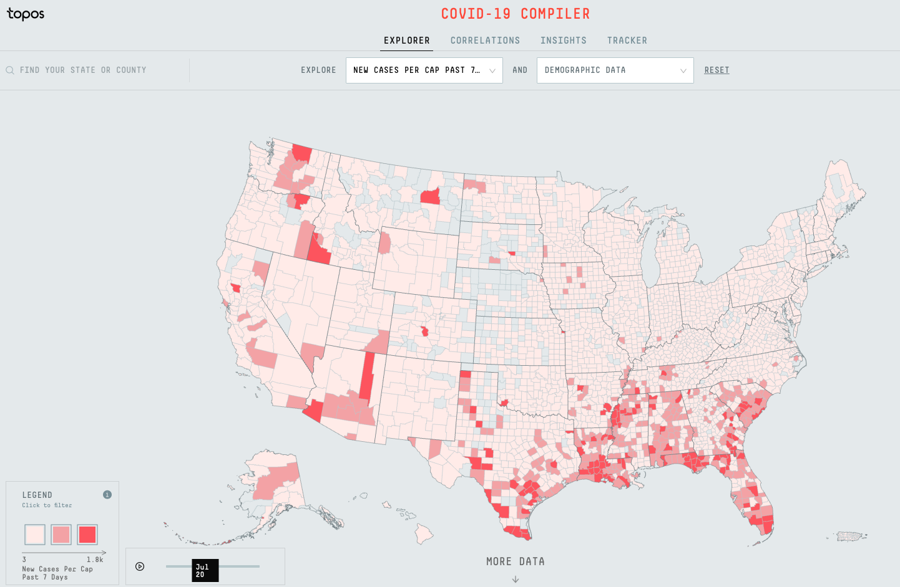

# Westchester_covid_tracker

## Description
The goal of this project is to **provide local, as-close-to-real-time-as-possible data for Westchester, NY** (the same method would work for any other U.S. county, too). In order to do so, I pull data from the NYTimes Covid tracker (https://github.com/nytimes/covid-19-data), engineer the data, and visualize the data. 

## Motivation
The motivation for this project is to have a more local, and up-to-date picture of Covid for where I live. Since Covid is in a majority of the news since March 2020, it's easy to lose perspective on the pandemic. July 2020, for example, had lots of news about the "Second Wave" (depending on how you view things) sweeping across the U.S., but this was mainly limited to the South. This can be seen in this visualization of the new cases per capita in the past 7 days (courtesy of Topos Covid Tracker (https://covid19.topos.com)):

Similarly, there are clear spikes in some areas of the United States that are not seen in others. To show this, take a look at the spikes in new daily cases for the United States as a whole, and for New York (courtesy of Google's covid dashboard):

There are clear differences in the number of people who are infected at a local level, as compared to the national level. This is important because **one needs to know the current level of infected people in their area when assessing the risk of certain activites**. Having a maskless lunch outside between 5 people may be acceptable in a period of low Covid cases in your area, but should definitely be avoided during a local spike (everyone has different levels of accepted risk, this example is not intended to condone one behavior or another, just to provide an example of risk calculation). With this in mind, I began this project.

## Data and Findings
The data is cloned from the NYTimes covid tracker whenever one wants another update on the status of Covid in Westchester, NY. To process the data, I scale the number of cases to the population of Westchester, NY and calculate new cases over the previous 7 days. This latter measurement helps give an idea of how many people currently have Covid in an area (https://blog.covidactnow.org/daily-new-cases-explained/). 

Once the data is saved to a pandas DataFrame, it is loaded into a new notebook and the data is visualized in a variety of ways. The main ones being, accumulative cases per capita and new cases per capita. Both of which can be found below:

The accumulative cases show periods in which the total count is "stable" and growing. The per capita aspect to the data lets one get an idea of the scale of the virus on the community. The new cases per capita visualization also shows the amount of growth the virus has in a slightly more clear way. From this chart, we can clearly see that Westchester experienced 2 (maybe 3) clear waves of the virus. The summer of 2020, for example, is very, very different from the end of 2020. This chart helps one irrefutably realize this.

## Technologies used
- Jupyter Notebook
- Python 
    - Seaborn
    - Pandas
